<p align="center">
  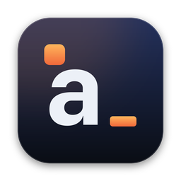
</p>

<h1 align="center">Ajandam</h1>

<p align="center">
  <b>Kişisel finans, ajanda ve notlar; tek uygulamada, Mac'inde ve Windows'ta.</b><br>
  Hesap yok, sunucu yok, abonelik yok. Yapay zekası API anahtarı istemez.
</p>

<p align="center">
  <a href="https://github.com/tolgacodes-dev/ajandam/releases/latest/download/Ajandam.dmg"><b>⬇ Mac için indir</b></a>
  &nbsp;·&nbsp; <a href="https://github.com/tolgacodes-dev/ajandam/releases/latest/download/Ajandam-Kurulum.exe"><b>⬇ Windows için indir</b></a>
  &nbsp;·&nbsp; <a href="#kurulum">Kurulum</a>
  &nbsp;·&nbsp; <a href="#yapay-zeka">Yapay zeka</a>
  &nbsp;·&nbsp; <a href="#destek-ve-iletişim">Destek</a>
  &nbsp;·&nbsp; <a href="#english">English</a>
</p>

<p align="center">
  <a href="https://github.com/tolgacodes-dev/ajandam/releases/latest"></a>
  
  
  
  
</p>

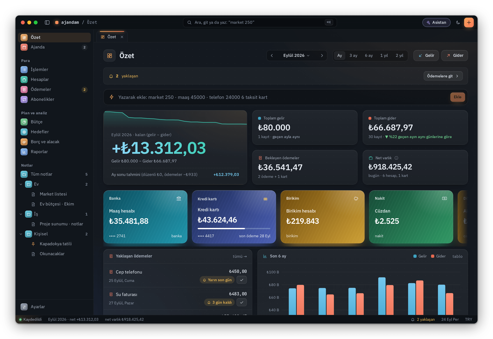

## Neden Ajandam?

- **Kayıtların bilgisayarında kalır.** Hesap açmazsın; Ajandam kayıtlarını hiçbir sunucuya göndermez. İstersen iCloud
  Drive'a (Windows'ta OneDrive'a) yedekler; Touch ID, Windows Hello ya da PIN ile kilitlenir.
- **Türkiye için yapıldı.** Kredi kartı kesim ve son ödeme günleri, taksitler, asgari ödeme (%20 / %40), TCMB azami
  faiz oranları, TÜFE ile enflasyon raporu, kira artış sınırı, resmî tatiller, vergi takvimi, BES devlet katkısı.
- **Yapay zeka, anahtarsız.** Apple Intelligence (Mac) ya da Ollama, LM Studio gibi yerel modellerle bilgisayarında
  çalışır; istersen ChatGPT hesabınla giriş yapar ya da Claude, ChatGPT gibi uygulamaları tek tuşla bağlarsın. Önerdiği
  hiçbir şey sen onaylamadan kaydedilmez.
- **Para, ajanda ve notlar bir arada.** Ödeme günleri takvimde, bütçe hedefleri notlarında; hepsi aynı aramada (⌘K / Ctrl+K).
- **Ücretsiz ve güncel.** Yeni sürüm çıkınca Ajandam haber verir; imzası doğrulanır, tek tıkla kurulur.

## Ekranlar

### Ajandam Asistanı

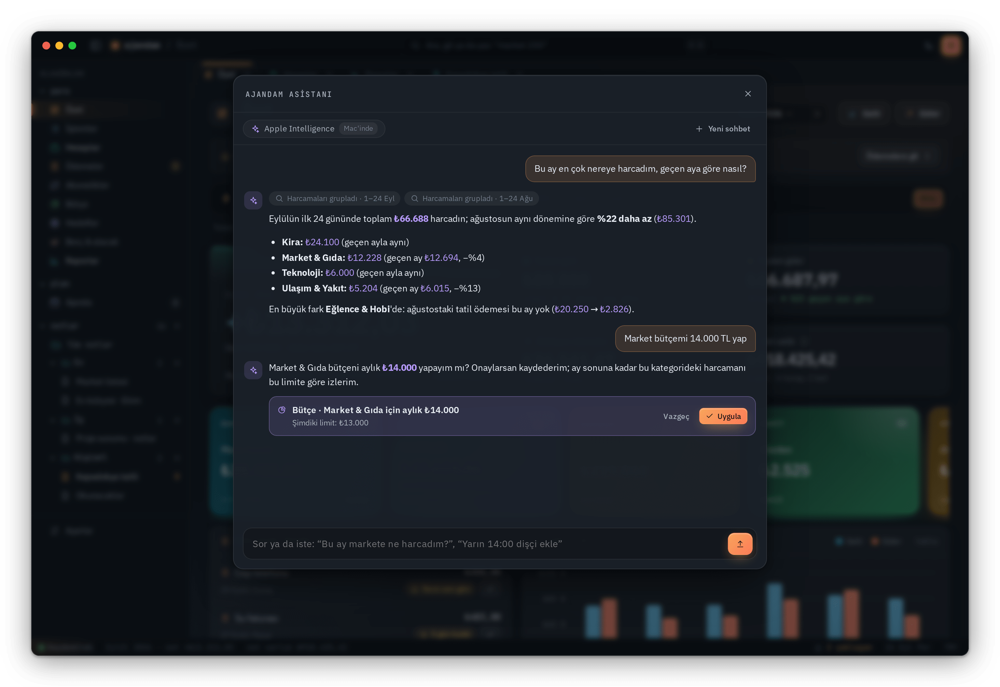

Üst çubuktaki **✦ Asistan** düğmesiyle ya da ⇧⌘A ile açılır. "Bu ay en çok nereye harcadım?", "Kartımı yalnızca
asgariyi ödersem ne zaman biter?" gibi soruları kayıtlarına bakarak cevaplar; hangi kayıtlara baktığını gösterir.
Kayıt eklemeyi ya da bütçe değiştirmeyi önerebilir; sen **Uygula** demeden hiçbir şey değişmez. Yapay zeka kapalıyken
basit soruları yine kayıtlarından cevaplar.

### Ekstre ve hesap dökümü içe aktarma

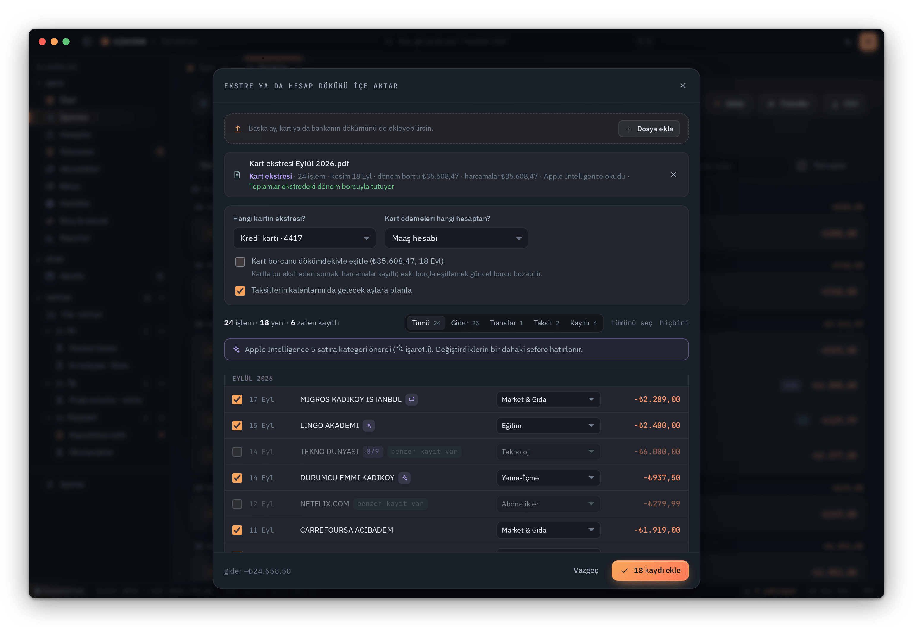

Bankanın internet şubesinden indirdiğin PDF ya da Excel dökümünü bırak. Satırlar okunur, toplam ekstredeki dönem
borcuyla karşılaştırılır, daha önce girdiğin kayıtlar ikinci kez eklenmez, taksitlerin kalanı gelecek aylara
planlanır. Kurallarla okunamayan ya da taranmış dökümleri yapay zeka okur; tanımadığı iş yerlerine kategori önerir.
Bir kategoriyi düzeltirsen Ajandam öğrenir, sonraki dökümlerde kendiliğinden uygular.

### Kredi kartı araçları

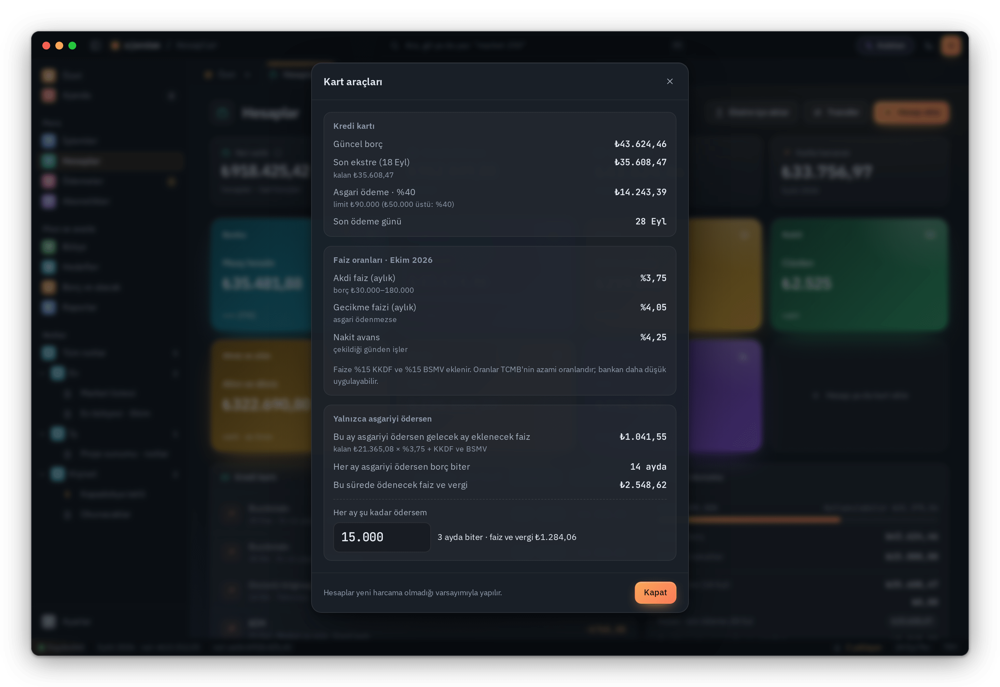

Asgari ödeme (limite göre %20 ya da %40), akdi ve gecikme faizi, KKDF ve BSMV ile "yalnızca asgariyi ödersem" ve
"her ay şu kadar ödersem" hesabı. Hafta sonuna ya da resmî tatile denk gelen son ödeme günü ilk iş gününe kayar.

### Net varlık

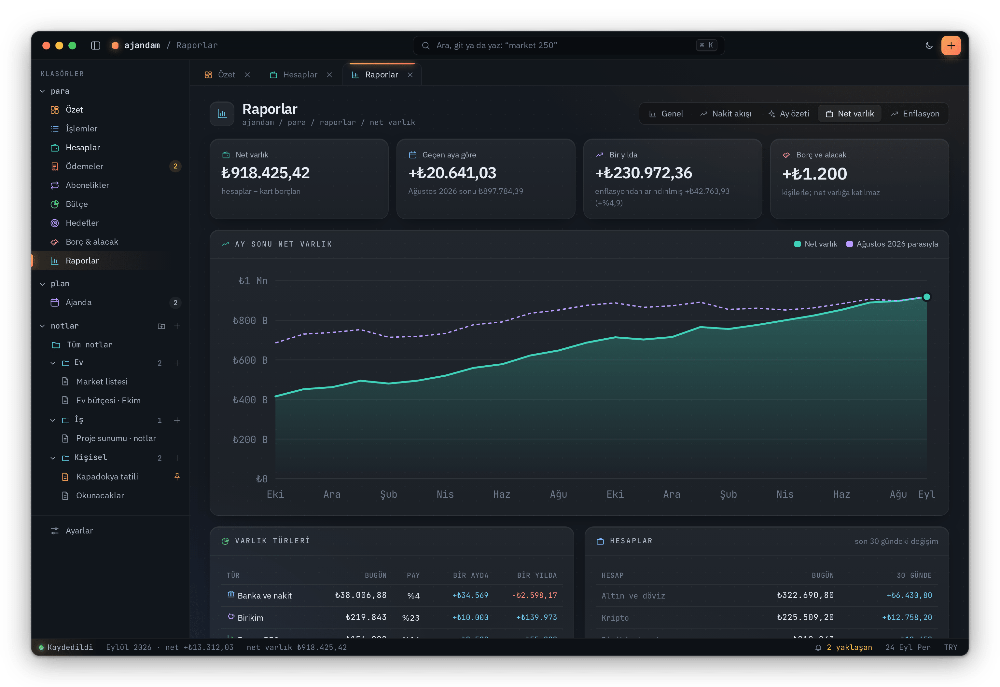

Banka, birikim, döviz ve altın, kripto, fon ve BES hesaplarının toplamı; kart borçları düşülür. Döviz, altın ve
kripto canlı fiyatla hesaplanır. Bir yılda ne kadar arttığını enflasyondan arındırılmış olarak da görürsün.

### Enflasyon ve kira artışı

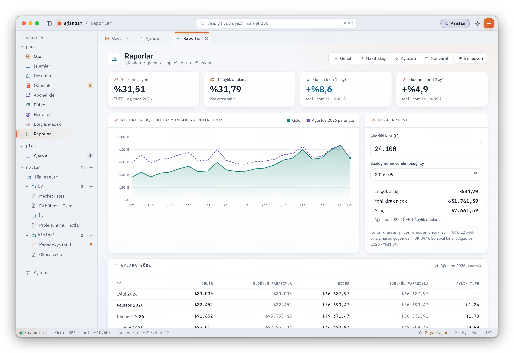

Gelir ve giderlerin TÜİK'in TÜFE verisiyle bugünün parasına çevrilir: gelirin enflasyonu yendi mi, harcaman gerçekte
arttı mı görürsün. Kira artışı, yenilemeden önceki ayın TÜFE 12 aylık ortalamasıyla hesaplanır (TBK 344).

### Ve daha fazlası

<table>
  <tr>
    <td width="50%" valign="top">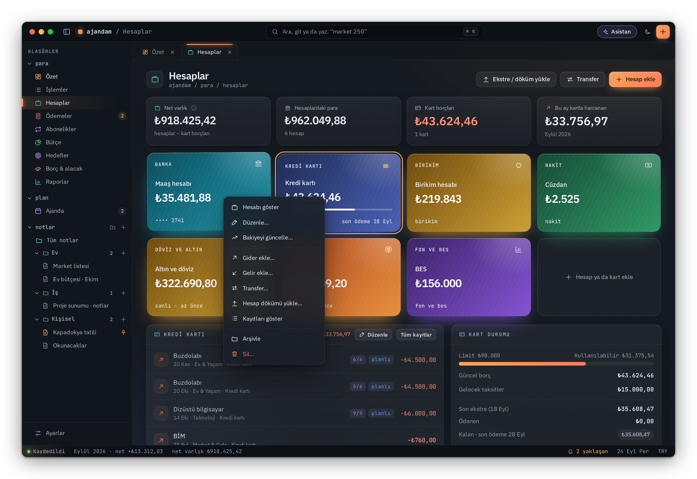<br><b>Sağ tık menüleri</b><br><sub>Hesapta, işlemde, ödemede, notta ve takvim gününde o şeye ait işlemler.</sub></td>
    <td width="50%" valign="top">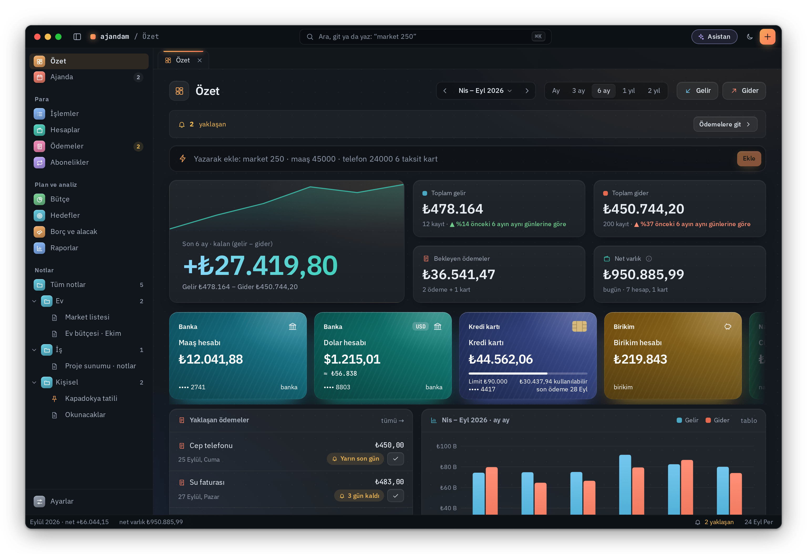<br><b>Özet dönemleri</b><br><sub>Tek ay ya da son 3, 6, 12, 24 ay; önceki dönemle karşılaştırmalı.</sub></td>
  </tr>
  <tr>
    <td width="50%" valign="top">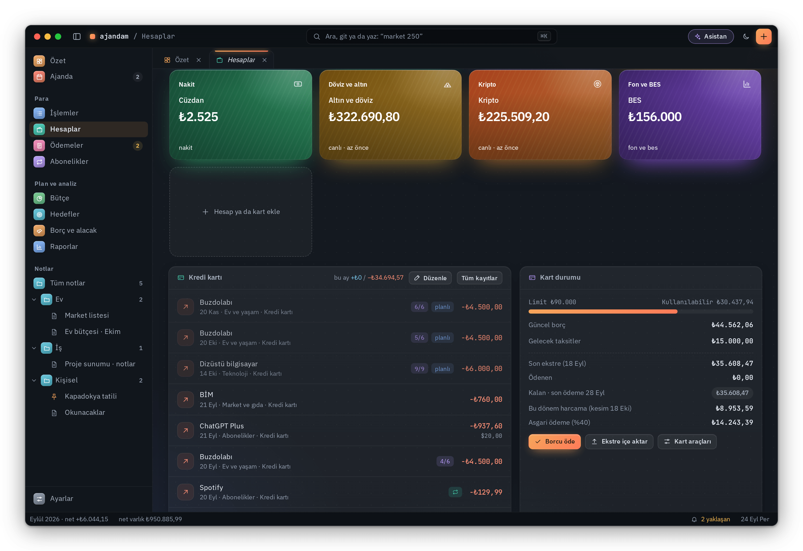<br><b>Hesaplar ve kartlar</b><br><sub>Kart limiti, kullanılabilir tutar, gelecek taksitler ve ekstre durumu.</sub></td>
    <td width="50%" valign="top">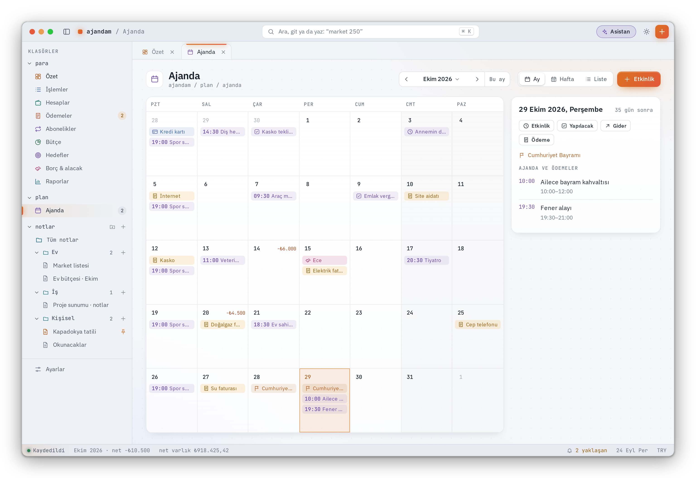<br><b>Ajanda</b><br><sub>Etkinlikler, yapılacaklar, ödeme günleri, resmî tatiller ve arifeler.</sub></td>
  </tr>
  <tr>
    <td width="50%" valign="top">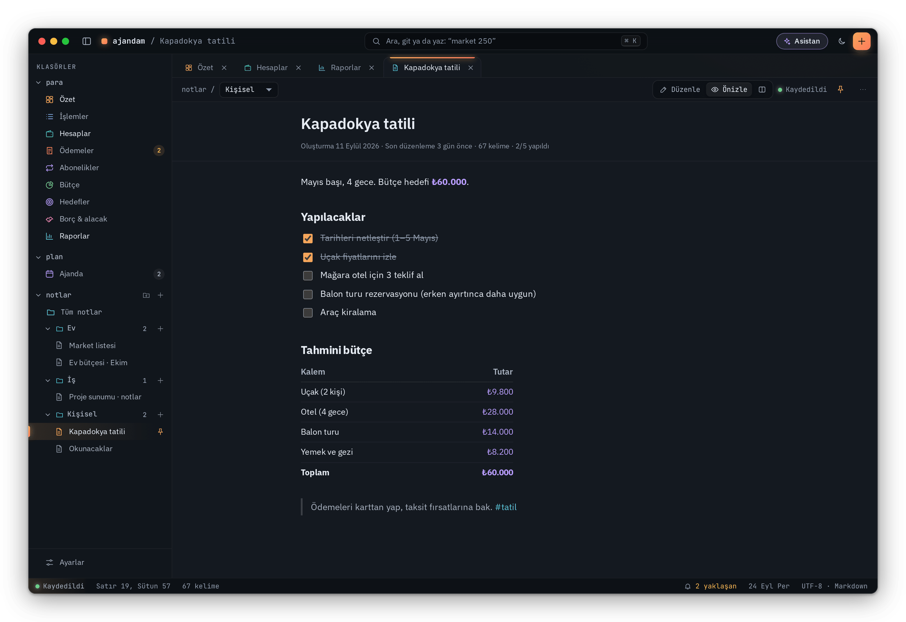<br><b>Notlar</b><br><sub>Markdown, yapılacak listeleri, tablolar, etiketler ve klasörler.</sub></td>
    <td width="50%" valign="top">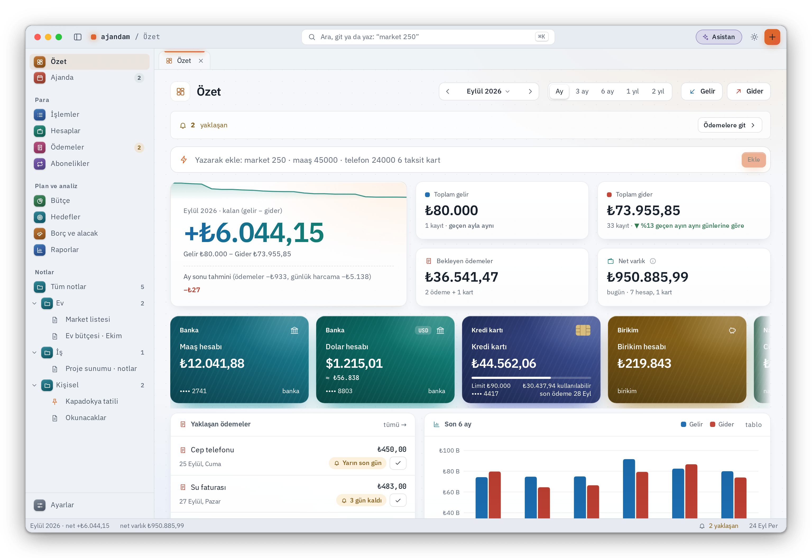<br><b>Açık ve koyu tema</b><br><sub>Mac'in görünümünü izler; istersen cam görünüm.</sub></td>
  </tr>
  <tr>
    <td width="50%" valign="top">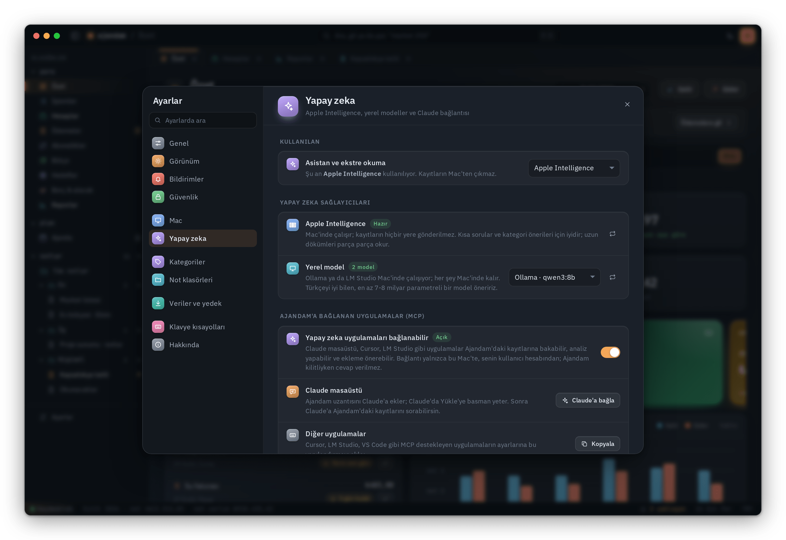<br><b>Yapay zeka ayarları</b><br><sub>Apple Intelligence, ChatGPT, yerel model ve Claude bağlantısı tek yerde.</sub></td>
    <td width="50%" valign="top">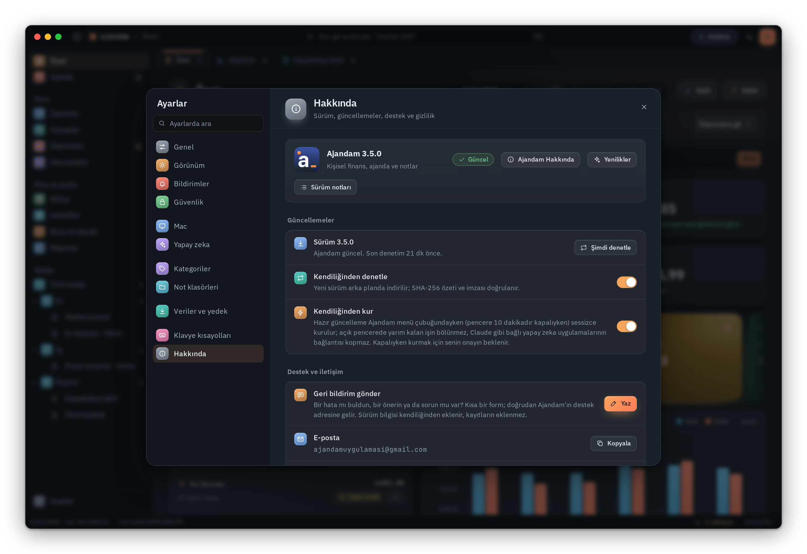<br><b>Hakkında</b><br><sub>Sürüm, güncellemeler, destek ve gizlilik.</sub></td>
  </tr>
</table>

<sub>Ekran görüntülerindeki adlar, tutarlar ve kayıtlar uydurmadır.</sub>

## Özellikler

- **Para:** gelir ve gider, hesaplar arası transfer, kredi kartları (kesim ve son ödeme günü, taksit, asgari ödeme),
  düzenli kayıtlar, ödemeler ve faturalar, abonelikler (kendiliğinden yakalanır), bütçe, hedefler, borç ve alacak.
- **Raporlar:** genel görünüm, nakit akışı tahmini, ay özeti, net varlık, enflasyon. Özet tek ay ya da son 3 ay,
  6 ay, 1 yıl, 2 yıl için; önceki dönemle karşılaştırmalı.
- **Hızlı ekleme:** "market 250", "telefon 24000 6 taksit kart" yaz; kategori, tarih ve hesap kendiliğinden bulunur.
  Her uygulamanın üstünde ⌃⌥A ile küçük ekleme penceresi açılır; menü çubuğundan da eklersin.
- **İçe aktarma:** banka ve kart dökümleri (PDF, Excel), fiş fotoğrafı, CSV dışa aktarma, tam yedek ve geri yükleme.
- **Ajanda:** ay, hafta ve liste görünümü; tekrar eden etkinlikler, yapılacaklar, hatırlatmalar. İstersen
  Anımsatıcılar üzerinden iPhone'una da düşer.
- **Notlar:** Markdown, yapılacak listeleri, tablolar, etiketler, klasörler, sabitleme, yazdırma.
- **Mac:** her şeyde sağ tık menüsü (hesap, işlem, ödeme, not, takvim günü), ⌘Z ile geri alma, bildirimlerde
  "Ödendi" ve "Yarın hatırlat", Dock rozeti, PIN ve istersen Touch ID kilidi (PIN'i unutursan Mac parolanla
  sıfırlarsın), sürükle-bırak, klavye kısayolları, açık ve koyu tema.

## Kurulum

### Mac

**Gereksinimler:** macOS 12 Monterey ya da üstü; Apple çipli ve Intel Mac'ler. Apple Intelligence için macOS 26 ve
Apple çipli bir Mac gerekir; yapay zekanın diğer yolları her Mac'te çalışır.

**Terminal ile (önerilen):** aşağıdaki satırı Terminal'e yapıştır. Son sürümü indirir, SHA-256 özetini ve imzasını
doğrular, **Uygulamalar** klasörüne kurar ve açar; macOS'un ilk açılış uyarısı çıkmaz.

```sh
curl -fsSL https://raw.githubusercontent.com/tolgacodes-dev/ajandam/main/scripts/kur.sh | bash
```

**Disk görüntüsüyle:** [Ajandam.dmg](https://github.com/tolgacodes-dev/ajandam/releases/latest/download/Ajandam.dmg)
dosyasını indir, aç ve Ajandam'ı **Uygulamalar** klasörüne sürükle. Ajandam bir Apple geliştirici hesabıyla değil,
kendi sertifikasıyla imzalanır; bu yüzden ilk açılışta macOS uyarır:

1. Ajandam'ı bir kez aç; macOS "açılamadı" derse **Bitti**'ye bas.
2. **Sistem Ayarları › Gizlilik ve Güvenlik** bölümünün altındaki **Yine de Aç** düğmesine bas ve onayla.

Bu yalnızca ilk kurulumda gerekir. Ajandam ilk açılışta boştur; kayıtlarını sen girersin ya da dökümlerini içe
aktarırsın.

**Güncellemeler:** yeni sürüm çıkınca Ajandam arka planda indirir, imzasını ve özetini doğrular, haber verir;
tek tıkla kurulur. Kayıtların olduğu gibi kalır. **Ajandam › Güncellemeleri Denetle…** ile hemen bakabilirsin.

**Kaldırma:** Ajandam'ı Uygulamalar klasöründen çöp sepetine taşı. Kayıtların
`~/Library/Application Support/Ajandam` klasöründedir; onları da silmek istersen bu klasörü sil.

### Windows

**Gereksinimler:** Windows 10 ya da 11, 64 bit.

[Ajandam-Kurulum.exe](https://github.com/tolgacodes-dev/ajandam/releases/latest/download/Ajandam-Kurulum.exe)
dosyasını indir ve çalıştır. Ajandam kendi kullanıcı klasörüne kurulur, yönetici izni istemez. Kurulum dosyası bir
sertifika kuruluşunca imzalanmadığı için Windows ilk çalıştırmada "Windows kişisel bilgisayarınızı korudu" diyebilir:
**Ek bilgi › Yine de çalıştır**. Bu yalnızca ilk kurulumda gerekir.

Kayıtların Mac'teki yedekten taşınabilir: Mac'te **Ayarlar › Veriler ve yedek › Yedek indir**, Windows'ta aynı yerden
**Yedekten geri yükle**.

**Güncellemeler:** yeni sürüm arka planda indirilir, imzası ve SHA-256 özeti Ajandam'ın kendi anahtarıyla doğrulanır;
Ajandam bildirim alanındayken ya da çıkarken kendiliğinden kurulur (istersen **Ayarlar › Hakkında**'dan kapatıp
"Şimdi güncelle" ile kurarsın).

**Kaldırma:** **Ayarlar › Uygulamalar › Yüklü uygulamalar › Ajandam › Kaldır**. Kayıtların `%APPDATA%\Ajandam`
klasöründedir ve kaldırınca silinmez; onları da silmek istersen bu klasörü sil.

## Yapay zeka

Ajandam'ın yapay zekası API anahtarı istemez; **Ayarlar › Yapay zeka** bölümünden seçersin.

| | Nerede çalışır | Ne zaman |
|---|---|---|
| **Apple Intelligence** | Mac'inde; kayıtların hiçbir yere gitmez | macOS 26, Apple çipli Mac |
| **Yerel model** ([Ollama](https://ollama.com), [LM Studio](https://lmstudio.ai)) | Bilgisayarında | Uygulama açıkken kendiliğinden bulunur |
| **ChatGPT** (hesabınla giriş) | OpenAI'de; yalnızca izin verdiğin özetler gider | ChatGPT planın yeter, API anahtarı gerekmez |
| **Claude** (masaüstü uygulaması, MCP) | Claude'da | Ajandam uzantısını tek tıkla eklersin |
| **ChatGPT** (masaüstü uygulaması, MCP) | ChatGPT'de | Ajandam'ı ChatGPT'nin ayarlarına tek tıkla eklersin |

Asistan, ekstre okuma ve kategori önerileri bu yollardan biriyle çalışır. Claude, ChatGPT ya da Cursor gibi MCP destekleyen
uygulamalar, sen izin verirsen Ajandam'daki kayıtlarına bakabilir, analiz yapabilir ve ekleme önerebilir; öneriler
senin onayını bekler. **Ayarlar › Yapay zeka › Hangi uygulamayla çalışacaksın?** listesinden Claude, ChatGPT, Google
Antigravity, LM Studio, Cursor, VS Code, Claude Code, OpenCode, Cline ve Kimi Code'u tek tuşla bağlar, bağlantıyı
test edersin. Ayrıntılar: [docs/yapay-zeka.md](docs/yapay-zeka.md)

## Gizlilik ve güvenlik

- Kayıtlar yalnızca bilgisayarında, kullanıcı hesabının klasöründe durur. Ajandam geliştiriciye hiçbir veri göndermez.
- İnternete yalnızca güncelleme denetimi (GitHub), canlı döviz, altın, kripto fiyatları ve senin bağladığın yapay zeka
  için çıkar. Güncelleme ve fiyat isteklerinde kayıtlarına ait bilgi yoktur; ChatGPT'ye yalnızca sorunu cevaplamak için
  gereken özetler, senin iznine bağlı olarak gider. Canlı fiyatları ayarlardan kapatabilirsin.
- Güncellemelerin imzası ve SHA-256 özeti doğrulanır; tutmayan güncelleme kurulmaz, açılamayan sürümden önceki sürüme
  dönülür.
- Bir güvenlik açığı bulduysan lütfen [SECURITY.md](SECURITY.md)'deki yolu izle.

## Destek ve iletişim

- **Hata, öneri ya da soru için:** Ajandam'da **Yardım › Geri Bildirim Gönder…** formu GitHub'da hazır doldurulmuş
  bir konu açar. Doğrudan [Issues › Yeni](https://github.com/tolgacodes-dev/ajandam/issues/new/choose) de olur.
  Ekran görüntüsü eklersen tutarları ve adları gizle; kayıtlarını paylaşma.
- **İletişim:** [github.com/tolgacodes-dev](https://github.com/tolgacodes-dev)
- **Sürüm notları:** [CHANGELOG.md](CHANGELOG.md) ve [Sürümler](https://github.com/tolgacodes-dev/ajandam/releases)

**Yakında:** Linux ve mobil (iPhone ve Android) sürümleri üzerinde çalışılıyor.

## Lisans

Ajandam kişisel kullanım için ücretsizdir; kaynak kodu açık değildir ve bütün hakları saklıdır. Ayrıntılar:
[LICENSE](LICENSE)

---

## English

**Ajandam** is a free personal finance, calendar and notes app for Mac and Windows, made for Turkey. Your records
stay on your computer: no account, no server, no subscription.

- **Money:** accounts, credit cards with statement and due dates, installments and minimum payments, budgets,
  subscriptions, goals, debts; bank and card statement import (PDF, Excel) with reconciliation and duplicate detection.
- **Turkey-specific:** CPI (TÜFE) based inflation report, rent increase cap, central bank card interest rates,
  public holidays, tax calendar, private pension (BES) state contribution.
- **AI without API keys:** Apple Intelligence (Mac) or local models (Ollama, LM Studio) on your computer, sign in
  with your ChatGPT account, or connect Claude, ChatGPT and other MCP apps in one click. Nothing is saved without your
  approval.
- **Calendar and notes:** month, week and list views, to-dos, Markdown notes with tables.

**Install on Mac:** macOS 12 or later (Apple silicon and Intel). Run
`curl -fsSL https://raw.githubusercontent.com/tolgacodes-dev/ajandam/main/scripts/kur.sh | bash` in Terminal, or
download [Ajandam.dmg](https://github.com/tolgacodes-dev/ajandam/releases/latest/download/Ajandam.dmg).

**Install on Windows:** Windows 10 or 11 (64-bit). Download and run
[Ajandam-Kurulum.exe](https://github.com/tolgacodes-dev/ajandam/releases/latest/download/Ajandam-Kurulum.exe); if
SmartScreen warns, choose **More info › Run anyway**. No administrator rights needed.

Updates are verified with the app's own signing key and installed from inside the app. The app's interface is in
Turkish.

**Coming soon:** Linux and mobile (iPhone and Android) versions are in the works.

**Support:** [open an issue](https://github.com/tolgacodes-dev/ajandam/issues/new/choose) ·
[github.com/tolgacodes-dev](https://github.com/tolgacodes-dev)

<sub>© 2026 tolgacodes-dev. All rights reserved. Free for personal use; see [LICENSE](LICENSE).</sub>
