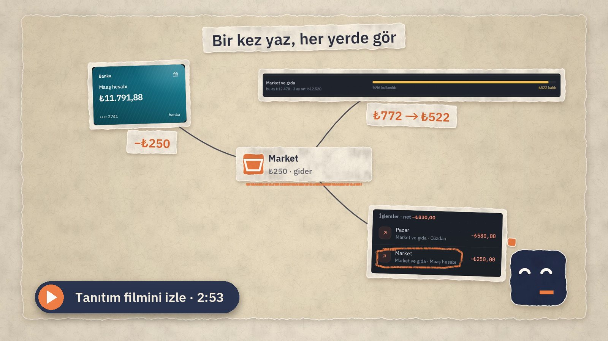
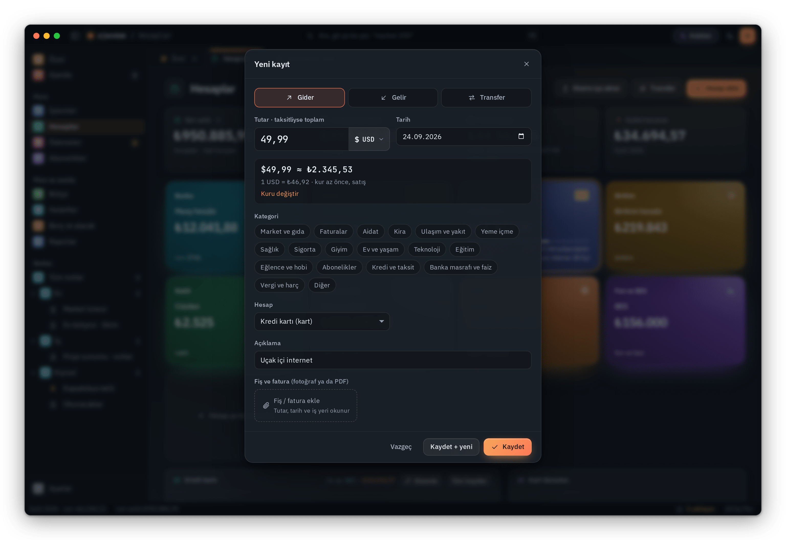
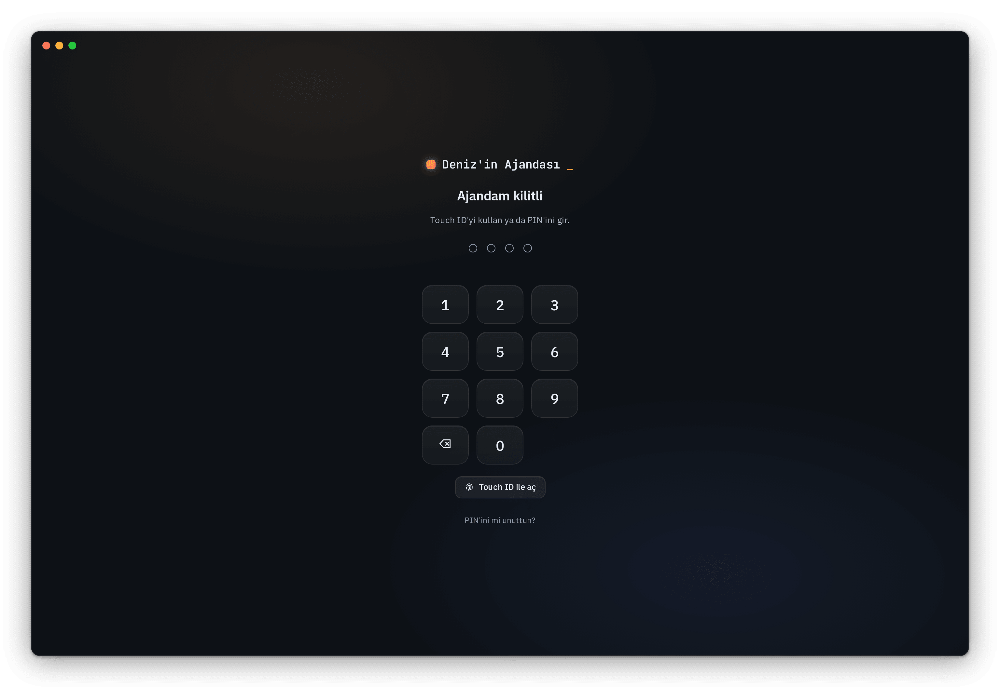
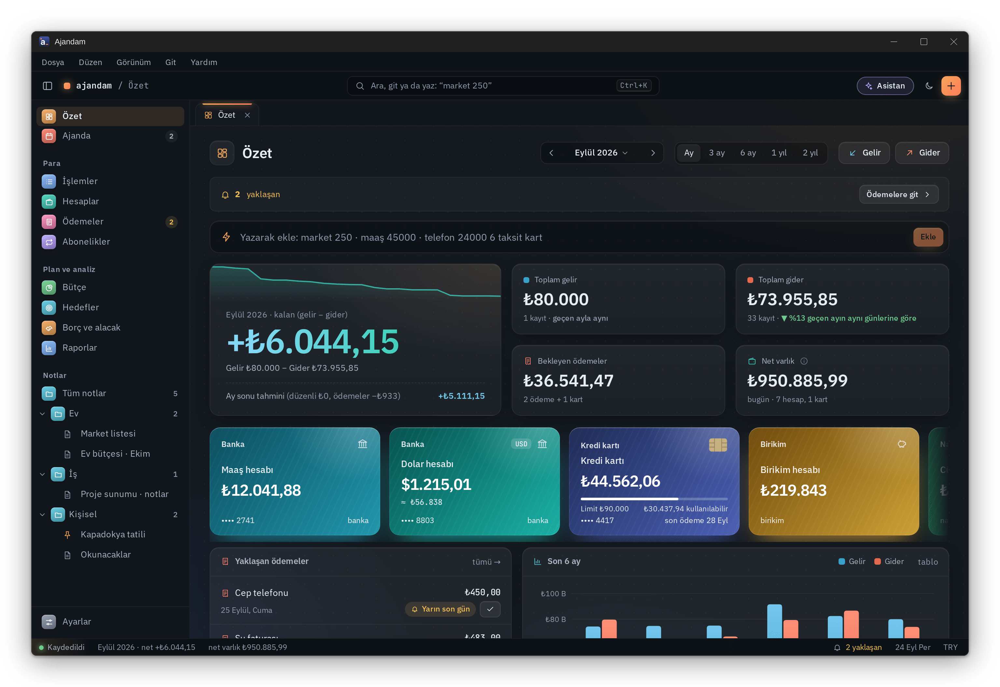

<p align="center">
  
</p>

<h1 align="center">Ajandam</h1>

<p align="center">
  <b>Kişisel finans, ajanda ve notlar; tek uygulamada, Mac'inde ve Windows'ta.</b><br>
  Hesap yok, sunucu yok, abonelik yok. Yapay zekası API anahtarı istemez.
</p>

<p align="center">
  <a href="https://github.com/tolgacodes-dev/ajandam/releases/latest/download/Ajandam.dmg"><b>⬇ Mac için indir</b></a>
  &nbsp;·&nbsp; <a href="https://github.com/tolgacodes-dev/ajandam/releases/latest/download/Ajandam-Kurulum.exe"><b>⬇ Windows için indir</b></a>
  &nbsp;·&nbsp; <a href="#kurulum">Kurulum</a>
  &nbsp;·&nbsp; <a href="#yapay-zeka">Yapay zeka</a>
  &nbsp;·&nbsp; <a href="#destek-ve-iletişim">Destek</a>
  &nbsp;·&nbsp; <a href="#english">English</a>
</p>

<p align="center">
  <a href="https://github.com/tolgacodes-dev/ajandam/releases/latest"></a>
  
  
  
  
</p>

<p align="center">
  <a href="https://tolgacodes-dev.github.io/tr/#film"></a>
</p>


## Neden Ajandam?

- **Kayıtların bilgisayarında kalır.** Hesap açmazsın; Ajandam kayıtlarını hiçbir sunucuya göndermez (yalnızca senin
  bağladığın yapay zekaya, senin izin verdiğin kadarı gider). İstersen iCloud Drive'a (Windows'ta OneDrive'a)
  yedekler; istersen PIN, Touch ID ya da Windows Hello ile kilitlenir.
- **Türkiye için yapıldı.** Kredi kartı kesim ve son ödeme günleri, taksitler, asgari ödeme (%20 / %40), TCMB azami
  faiz oranları, TÜFE ile enflasyon raporu, kira artış sınırı, resmî tatiller, vergi takvimi, BES devlet katkısı.
- **Yapay zeka, anahtarsız.** Apple Intelligence (Mac) ya da Ollama, LM Studio gibi yerel modellerle bilgisayarında
  çalışır; istersen ChatGPT hesabınla giriş yapar ya da Claude, ChatGPT gibi uygulamaları tek tuşla bağlarsın. Önerdiği
  hiçbir şey sen onaylamadan kaydedilmez.
- **Para, ajanda ve notlar bir arada.** Ödeme günleri takvimde, bütçe hedefleri notlarında; hepsi aynı aramada (⌘K / Ctrl+K).
- **Ücretsiz ve güncel.** Yeni sürüm arka planda iner, imzası doğrulanır ve kendiliğinden kurulur; istersen
  kendiliğinden kurmayı kapatıp tek tıkla kurarsın.

## Ekranlar

### Ajandam Asistanı


Üst çubuktaki **✦ Asistan** düğmesiyle ya da ⇧⌘A (Windows'ta Ctrl+Shift+A) ile açılır. "Bu ay en çok nereye harcadım?", "Kartımı yalnızca
asgariyi ödersem ne zaman biter?" gibi soruları kayıtlarına bakarak cevaplar; hangi kayıtlara baktığını gösterir.
İstersen kayıt eklemeyi ya da bütçe değiştirmeyi önerir; sen **Ekle** ya da **Uygula** demeden hiçbir şey değişmez.
Kayıtlarındaki yazılar (ör. bir havale açıklaması) asistana talimat veremez. Yapay zeka kapalıyken basit soruları
yine kayıtlarından cevaplar.

### Dövizli hesaplar ve harcamalar



Hesabı dolar, euro ya da 150'den fazla para biriminden biriyle açarsın; bakiyesi kendi para biriminde, TL karşılığı
altında görünür. Yurt dışı harcamasını kartına $49,99 diye yazarsın: o günün kuruyla TL karşılığı hesaplanır, bankanın
uyguladığı kuru biliyorsan **Kuru değiştir** ile girersin. Euro kartla dolar harcamada çapraz kur gösterilir. Net
varlık, bütçe ve raporlar TL'ye çevrilerek hesaplanır.

### Ekstre ve hesap dökümü içe aktarma


Bankanın internet şubesinden indirdiğin PDF ya da Excel dökümünü bırak. Satırlar okunur, toplam ekstredeki dönem
borcuyla karşılaştırılır, daha önce girdiğin kayıtlar ikinci kez eklenmez, taksitlerin kalanı gelecek aylara
planlanır. Kurallarla okunamayan ya da taranmış dökümleri yapay zeka okur; tanımadığı iş yerlerine kategori önerir.
Bir kategoriyi düzeltirsen Ajandam öğrenir, sonraki dökümlerde kendiliğinden uygular.

### Kredi kartı araçları


Asgari ödeme (limite göre %20 ya da %40), akdi ve gecikme faizi, KKDF ve BSMV ile "yalnızca asgariyi ödersem" ve
"her ay şu kadar ödersem" hesabı. Hafta sonuna ya da resmî tatile denk gelen son ödeme günü ilk iş gününe kayar.

### Net varlık


Banka, birikim, döviz ve altın, kripto, fon ve BES hesaplarının toplamı; kart borçları düşülür. Döviz, altın ve
kripto canlı fiyatla, dövizli hesaplar güncel kurla TL'ye çevrilir. Bir yılda ne kadar arttığını enflasyondan
arındırılmış olarak da görürsün.

### Enflasyon ve kira artışı


Gelir ve giderlerin TÜİK'in TÜFE verisiyle bugünün parasına çevrilir: gelirin enflasyonu yendi mi, harcaman gerçekte
arttı mı görürsün. Kira artışı, yenilemeden önceki ayın TÜFE 12 aylık ortalamasıyla hesaplanır (TBK 344).

### Ve daha fazlası

<table>
  <tr>
    <td width="50%" valign="top"><br><b>Sağ tık menüleri</b><br><sub>Hesapta, işlemde, ödemede, notta ve takvim gününde o şeye ait işlemler.</sub></td>
    <td width="50%" valign="top"><br><b>Özet dönemleri</b><br><sub>Tek ay ya da son 3, 6, 12, 24 ay; önceki dönemle karşılaştırmalı.</sub></td>
  </tr>
  <tr>
    <td width="50%" valign="top"><br><b>Hesaplar ve kartlar</b><br><sub>Kart limiti, kullanılabilir tutar, gelecek taksitler ve ekstre durumu.</sub></td>
    <td width="50%" valign="top"><br><b>Ajanda</b><br><sub>Etkinlikler, yapılacaklar, ödeme günleri, resmî tatiller ve arifeler.</sub></td>
  </tr>
  <tr>
    <td width="50%" valign="top"><br><b>Notlar</b><br><sub>Markdown, yapılacak listeleri, tablolar, etiketler ve klasörler.</sub></td>
    <td width="50%" valign="top"><br><b>Açık ve koyu tema</b><br><sub>Mac'in ya da Windows'un görünümünü izler; Mac'te istersen cam görünüm.</sub></td>
  </tr>
  <tr>
    <td width="50%" valign="top"><br><b>Yapay zeka ayarları</b><br><sub>Apple Intelligence, ChatGPT, yerel modeller ve Ajandam'a bağlanan uygulamalar tek yerde.</sub></td>
    <td width="50%" valign="top"><br><b>Hakkında</b><br><sub>Sürüm, güncellemeler, sürüm notları, destek, gizlilik ve kullanım koşulları.</sub></td>
  </tr>
  <tr>
    <td width="50%" valign="top"><br><b>Kilit ekranında adın</b><br><sub>PIN, Touch ID ya da Windows Hello; kilit ekranı adınla açılır.</sub></td>
    <td width="50%" valign="top"><br><b>Windows'ta</b><br><sub>Aynı Ajandam; menü çubuğu, bildirim alanı, görev çubuğu ve Windows bildirimleriyle.</sub></td>
  </tr>
</table>

<sub>Ekran görüntülerindeki adlar, tutarlar ve kayıtlar uydurmadır.</sub>

## Özellikler

- **Para:** gelir ve gider, hesaplar arası transfer, kredi kartları (kesim ve son ödeme günü, taksit, asgari ödeme),
  düzenli kayıtlar, ödemeler ve faturalar, abonelikler (kendiliğinden yakalanır), bütçe, hedefler, borç ve alacak.
  Dövizli hesaplar ve harcamalar: 150'den fazla para birimi; TL karşılığı o günün kuruyla, istersen kendi kurunla.
  Etiketler (#tatil), iade kaydı (iade gelir sayılmaz, kategorisinin harcamasından düşer), harcama bölme, vadeli
  mevduat (faiz, stopaj, net getiri, vade dolunca onay), kredi hesaplayıcı (KKDF ve BSMV), gelişmiş filtreler ve
  kayıtlı görünümler, kategori kuralları.
- **Raporlar:** genel görünüm, nakit akışı tahmini, ay özeti, net varlık, enflasyon, etiketler ve yılın özeti. Özet
  tek ay ya da son 3 ay, 6 ay, 1 yıl, 2 yıl için; önceki dönemle karşılaştırmalı. Sabah özetinde bütçe uyarısı.
- **Hızlı ekleme:** "market 250", "telefon 24000 6 taksit kart" yaz; kategori, tarih ve hesap kendiliğinden bulunur.
  "yarın 9 doktor" etkinlik, "her ayın 5'i kira 12.000" düzenli kayıt, "her pazartesi 10:00 toplantı" tekrarlayan
  etkinlik olur; "$5", "akşam 7'de", "haftaya salı" da anlaşılır. Hangi uygulamada olursan ol küçük bir ekleme
  penceresi açılır: Mac'te ⌃⌥A (menü çubuğundan da), Windows'ta Ctrl+Alt+Space (bildirim alanından ve görev
  çubuğundan da); kısayolu değiştirebilirsin.
- **İçe aktarma:** banka ve kart dökümleri (PDF, Excel, CSV; okunamayan dosyada sütunları kendin seçersin), fiş
  fotoğrafı, CSV dışa aktarma, takvime aktarma (.ics), tam yedek (fiş ve fatura ekleriyle) ve geri yükleme; geri
  yüklemeden önce neyin değişeceği gösterilir.
- **Ajanda:** ay, hafta ve liste görünümü; yapılacaklar ve hatırlatmalar. Tekrarlayan etkinlikler: her gün, N günde
  ya da haftada bir, seçtiğin günler, ayın son cuması; değiştirirken "yalnızca bu", "bu ve sonrakiler" ya da "tümü".
  Mac'te istersen Anımsatıcılar üzerinden iPhone'una da düşer.
- **Notlar:** Markdown (kod blokları, bağlantılar, iç içe listeler), yapılacak listeleri, tablolar, etiketler,
  alt klasörler, sürükle-bırak, arşiv, sabitleme, yazdırma; vurgulama, fotoğraf, işlem, etkinlik ve ödemelere
  bağlantı, yapılacak satırını ajandaya ekleme, hatırlatıcı; istediğin notu not parolasıyla şifreleme (istersen Touch
  ID ya da Windows Hello ile açarsın), Son silinenler (30 gün), not geçmişi, `[[Başlık]]` ile not bağlantıları,
  şablonlar, notta bul ve değiştir, içindekiler; .md ve .txt içe aktarma, bütün notları .zip olarak dışa aktarma.
- **Mac:** her şeyde sağ tık menüsü (hesap, işlem, ödeme, not, takvim günü), ⌘Z ile geri alma, bildirimlerde
  "Ödendi", "Yarın hatırlat", "Yapıldı" ve "10 dk ertele", Ajandam'ın kendi bildirim sesleri, Dock rozeti, Mac açılınca
  başlat (macOS 13 ve üstü), istersen PIN ve Touch ID kilidi (Mac uyuyunca ya da ekran kilitlenince Ajandam da
  kilitlenir; PIN'i unutursan Mac parolanla sıfırlarsın), sürükle-bırak, klavye kısayolları, açık ve koyu tema.
- **Windows:** Windows 11'de menü, arama ve pencere düğmeleri tek satırda (tümleşik başlık çubuğu, yerleşim
  önerileriyle; istersen klasik başlık), Dosya, Düzen, Görünüm, Git ve Yardım menüleri (Alt tuşlarıyla), her şeyde
  sağ tık menüsü, Ctrl+Z ile geri alma, bildirimlerde "Ödendi", "Yarın hatırlat", "Yapıldı" ve "10 dk ertele", bildirim alanı ve görev çubuğu
  rozeti, istersen PIN ve Windows Hello kilidi (Win+L ile Ajandam da kilitlenir; PIN'i unutursan Windows Hello ile
  sıfırlarsın), sürükle-bırak, klavye kısayolları; kurumsal ağlarda Windows'un vekil sunucu ayarı kullanılır.
- **Senin Ajandan:** kilit ekranında adın, 24 kart rengi, dört uygulama simgesi, her bildirim türüne ayrı ses.
  **Tutarları gizle** (Mac'te ⇧⌘H, Windows'ta Ctrl+Shift+H) ekrandaki bütün tutarları ₺••• yapar.

## Kurulum

### Mac

**Gereksinimler:** macOS 12 Monterey ya da üstü; Apple çipli ve Intel Mac'ler. Apple Intelligence için macOS 26 ve
Apple çipli bir Mac gerekir; yapay zekanın diğer yolları her Mac'te çalışır.

**Terminal ile (önerilen):** aşağıdaki satırı Terminal'e yapıştır. Son sürümü indirir, SHA-256 özetini ve imzasını
doğrular, **Uygulamalar** klasörüne kurar ve açar; macOS'un ilk açılış uyarısı çıkmaz.

```sh
curl -fsSL https://raw.githubusercontent.com/tolgacodes-dev/ajandam/main/scripts/kur.sh | bash
```

**Disk görüntüsüyle:** [Ajandam.dmg](https://github.com/tolgacodes-dev/ajandam/releases/latest/download/Ajandam.dmg)
dosyasını indir, aç ve Ajandam'ı **Uygulamalar** klasörüne sürükle. Ajandam bir Apple geliştirici hesabıyla değil,
kendi sertifikasıyla imzalanır; bu yüzden ilk açılışta macOS uyarır:

1. Ajandam'ı bir kez aç; macOS "açılamadı" derse **Bitti**'ye bas.
2. **Sistem Ayarları › Gizlilik ve Güvenlik** bölümünün altındaki **Yine de Aç** düğmesine bas ve onayla.

Bu yalnızca ilk kurulumda gerekir. Ajandam ilk açılışta boştur; kayıtlarını sen girersin ya da dökümlerini içe
aktarırsın.

**Güncellemeler:** yeni sürüm çıkınca Ajandam arka planda indirir, imzasını ve özetini doğrular; Ajandam menü
çubuğundayken (pencere 10 dakikadır kapalıyken) kendiliğinden kurar. İstersen **Ayarlar › Hakkında**'dan kapatıp
"Şimdi güncelle" ile kurarsın. Kayıtların olduğu gibi kalır. **Ajandam › Güncellemeleri Denetle…** ile hemen
bakabilirsin.

**Kaldırma:** Ajandam'ı Uygulamalar klasöründen çöp sepetine taşı. Kayıtların
`~/Library/Application Support/Ajandam` klasöründedir; onları da silmek istersen bu klasörü sil.

### Windows

**Gereksinimler:** Windows 10 ya da 11, 64 bit. Ajandam, Windows'taki Microsoft Edge WebView2 bileşenini kullanır;
bilgisayarında yoksa (çoğunda vardır) kurulum dosyası onu indirip kurar, bunun için internet gerekir.

[Ajandam-Kurulum.exe](https://github.com/tolgacodes-dev/ajandam/releases/latest/download/Ajandam-Kurulum.exe)
dosyasını indir ve çalıştır. Ajandam kendi kullanıcı klasörüne kurulur, yönetici izni istemez. Kurulum dosyası bir
sertifika kuruluşunca imzalanmadığı için Windows ilk çalıştırmada "Windows kişisel bilgisayarınızı korudu" diyebilir:
**Ek bilgi › Yine de çalıştır**. Bu yalnızca ilk kurulumda gerekir.

Kayıtların Mac'teki yedekten taşınabilir: Mac'te **Ayarlar › Veriler ve yedek › Yedek indir**, Windows'ta aynı yerden
**Yedekten geri yükle**.

İndirdiğin dosyayı elle doğrulamak istersen her sürümün **SHA256SUMS** dosyasındaki özetle karşılaştır
(Mac'te `shasum -a 256 Ajandam.dmg`, Windows'ta `certutil -hashfile Ajandam-Kurulum.exe SHA256`).

**Güncellemeler:** yeni sürüm arka planda indirilir, imzası ve SHA-256 özeti Ajandam'ın kendi anahtarıyla doğrulanır;
Ajandam bildirim alanındayken ya da çıkarken kendiliğinden kurulur (istersen **Ayarlar › Hakkında**'dan kapatıp
"Şimdi güncelle" ile kurarsın).

**Kaldırma:** **Ayarlar › Uygulamalar › Yüklü uygulamalar › Ajandam › Kaldır**. Kayıtların `%APPDATA%\Ajandam`
klasöründedir; kaldırma penceresinde **Uygulama verilerini sil**'i işaretlersen onlar da silinir, işaretlemezsen
kalır. Ajandam'ın zamanlanmış bildirimleri her durumda kaldırılır.

## Yapay zeka

Ajandam'ın yapay zekası API anahtarı istemez; **Ayarlar › Yapay zeka** bölümünden seçersin.

| | Nerede çalışır | Ne zaman |
|---|---|---|
| **Apple Intelligence** | Mac'inde; kayıtların hiçbir yere gitmez | macOS 26, Apple çipli Mac |
| **Yerel model** ([Ollama](https://ollama.com), [LM Studio](https://lmstudio.ai)) | Bilgisayarında | Uygulama açıkken kendiliğinden bulunur |
| **ChatGPT** (hesabınla giriş) | OpenAI'de; soruyla ilgili kayıtların senin izninle gider, IBAN ve kart numarası gizlenir | ChatGPT Plus ya da Pro planın yeter, API anahtarı gerekmez |
| **Claude** (masaüstü uygulaması, MCP) | Claude'da | Ajandam uzantısını tek tıkla eklersin |
| **ChatGPT** (masaüstü uygulaması, MCP) | ChatGPT'de | Ajandam'ı ChatGPT'nin ayarlarına tek tıkla eklersin |

Asistan, ekstre okuma ve kategori önerileri bu yollardan biriyle çalışır; **Otomatik** seçiliyken önce
bilgisayarındaki model kullanılır. Claude, ChatGPT ya da Cursor gibi MCP destekleyen uygulamalar, sen izin verirsen
Ajandam'daki kayıtlarına bakabilir, analiz yapabilir, ekleme ve değişiklik önerebilir; öneriler senin onayını bekler. **Ayarlar › Yapay zeka › Hangi uygulamayla çalışacaksın?** listesinden Claude, ChatGPT, Google
Antigravity, LM Studio, Cursor, VS Code, Claude Code, OpenCode, Cline ve Kimi Code'u tek tuşla bağlar, bağlantıyı
test edersin. Ayrıntılar: [docs/yapay-zeka.md](docs/yapay-zeka.md)

## Gizlilik ve güvenlik

- Kayıtlar yalnızca bilgisayarında, kullanıcı hesabının klasöründe durur. Ajandam hesap açtırmaz; reklam, izleme kodu
  ya da kullanım istatistiği içermez. Kayıtlarından hiçbir şey geliştiriciye gönderilmez.
- Ajandam internetsiz de çalışır; internete yalnızca şunlar için çıkar:
  - güncelleme denetimi ve indirme (GitHub),
  - Türkiye verileri: TÜFE, kart faiz oranları, asgari ödeme sınırı, bayramlar ve kısa duyurular GitHub'daki,
    Ajandam'ın imzasıyla yayımlanan bir veri dosyasından gelir (güncelleme denetimi açıkken; imzası tutmayan veri
    kullanılmaz),
  - canlı kripto, döviz ve altın fiyatları ile döviz kurları: herkese açık kaynaklar (Binance, Truncgil, TCMB ve
    jsDelivr'deki günlük kur listesi; ona ulaşılamazsa aynı listenin currency-api.pages.dev'deki kopyası); geçmiş
    tarihli dövizli kayıtlar için o günün TCMB kuru,
  - senin bağladığın yapay zeka: ChatGPT'ye yalnızca sorunu cevaplamak için gereken kayıtlar, senin iznine bağlı olarak
    gider (IBAN, TC kimlik no, kart numarası, telefon ve e-posta gizlenir; notlar ayrı izinle),
  - geri bildirim: yalnızca sen gönderdiğinde, formda yazdıkların (ve eklediğin ekran görüntüsü) Google'ın Apps Script
    hizmeti üzerinden Ajandam'ın destek adresine e-postayla iletilir.

  Güncelleme, Türkiye verileri ve fiyat isteklerinde kayıtlarına ait bilgi yoktur. Canlı fiyatları ayarlardan
  kapatabilirsin.
- Güncellemelerin imzası ve SHA-256 özeti doğrulanır; tutmayan güncelleme kurulmaz. Mac'te açılamayan sürümden önceki
  sürüme dönülür.
- Bir güvenlik açığı bulduysan lütfen [SECURITY.md](SECURITY.md)'deki yolu izle.

## Destek ve iletişim

- **Hata, öneri ya da soru için:** Ajandam'da **Yardım › Geri Bildirim Gönder…** formuna yazdıkların doğrudan
  Ajandam'ın destek adresine gider; istersen yanıt adresini ve bir ekran görüntüsü eklersin. GitHub'da
  [Issues › Yeni](https://github.com/tolgacodes-dev/ajandam/issues/new/choose) de olur. Ekran görüntüsü eklersen
  tutarları ve adları gizle; kayıtlarını paylaşma.
- **E-posta:** ajandamuygulamasi@gmail.com
- **İletişim:** [github.com/tolgacodes-dev](https://github.com/tolgacodes-dev)
- **Sürüm notları:** uygulamada **Ayarlar › Hakkında › Sürüm notları**; ayrıca [CHANGELOG.md](CHANGELOG.md) ve
  [Sürümler](https://github.com/tolgacodes-dev/ajandam/releases)

**Yakında:** Linux ve mobil (iPhone ve Android) sürümleri üzerinde çalışılıyor.

## Lisans

Ajandam kişisel kullanım için ücretsizdir; kaynak kodu açık değildir ve bütün hakları saklıdır. Kullanım koşullarının
tamamı [LICENSE](LICENSE) dosyasında; aynı metin uygulamada **Ayarlar › Hakkında › Kullanım koşulları**'ndadır.
Ajandam'ın içindeki açık kaynak bileşenlerin listesi ve lisans metinleri:
[ACIK-KAYNAK-LISANSLARI.txt](ACIK-KAYNAK-LISANSLARI.txt)

---

## English

**Ajandam** is a free personal finance, calendar and notes app for Mac and Windows, made for Turkey. Your records
stay on your computer: no account, no server, no subscription.

**Film:** a three-minute tour (Turkish voice-over, English captions) on
[tolgacodes-dev.github.io](https://tolgacodes-dev.github.io/#film).

- **Money:** accounts, credit cards with statement and due dates, installments and minimum payments, budgets,
  subscriptions, goals, debts; foreign-currency accounts and expenses (150+ currencies, converted at the day's rate);
  tags, refunds, split transactions, time deposits with withholding tax, a loan calculator, saved filters and
  category rules; bank and card statement import (PDF, Excel, CSV) with reconciliation and duplicate detection.
- **Turkey-specific:** CPI (TÜFE) based inflation report, rent increase cap, central bank card interest rates,
  public holidays, tax calendar, private pension (BES) state contribution; updated between releases through a signed
  data feed.
- **AI without API keys:** Apple Intelligence (Mac) or local models (Ollama, LM Studio) on your computer, sign in
  with your ChatGPT Plus or Pro account, or connect Claude, ChatGPT and other MCP apps in one click. Nothing is saved
  without your approval.
- **Calendar and notes:** month, week and list views, flexible recurring events, to-dos with reminders, calendar
  export (.ics), quick add in plain Turkish ("yarın 9 doktor"), Markdown notes with tables, highlights, images and
  links to records, nested folders and an archive, per-note encryption (optionally unlocked with Touch ID or Windows
  Hello), recently deleted notes, note history, import and export.
- **Privacy:** no account, no ads, no tracking. Optional PIN, Touch ID or Windows Hello lock, and a privacy mode that
  hides every amount on screen. The app goes online only
  for update checks and the signed Turkey data feed (GitHub), public price and exchange-rate feeds, the AI service you
  connect, and feedback you choose to send.

**Install on Mac:** macOS 12 or later (Apple silicon and Intel). Run
`curl -fsSL https://raw.githubusercontent.com/tolgacodes-dev/ajandam/main/scripts/kur.sh | bash` in Terminal, or
download [Ajandam.dmg](https://github.com/tolgacodes-dev/ajandam/releases/latest/download/Ajandam.dmg).

**Install on Windows:** Windows 10 or 11 (64-bit). Download and run
[Ajandam-Kurulum.exe](https://github.com/tolgacodes-dev/ajandam/releases/latest/download/Ajandam-Kurulum.exe); if
SmartScreen warns, choose **More info › Run anyway**. No administrator rights needed.

Updates are verified with the app's own signing key and installed automatically in the background (you can turn this
off in Ayarlar › Hakkında, i.e. Settings › About). Each release lists SHA-256 checksums in **SHA256SUMS**. The app's interface is in Turkish.

**Coming soon:** Linux and mobile (iPhone and Android) versions are in the works.

**Support:** use **Yardım › Geri Bildirim Gönder** (Help › Send Feedback) in the app; it goes straight to the support
address. You can also email ajandamuygulamasi@gmail.com or
[open an issue](https://github.com/tolgacodes-dev/ajandam/issues/new/choose) ·
[github.com/tolgacodes-dev](https://github.com/tolgacodes-dev)

<sub>© 2026 tolgacodes-dev. All rights reserved. Free for personal use; see [LICENSE](LICENSE) and
[ACIK-KAYNAK-LISANSLARI.txt](ACIK-KAYNAK-LISANSLARI.txt) for bundled open source components.</sub>
